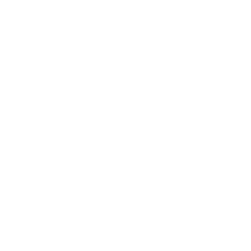

# Projeto Final - Bikcraft

## Projeto final utilizando todo conhecimento aprendido no curso de HTML e CSS para Iniciantes.

### Foi desenvolvido no curso de UI/UX Design a prototipação do projeto no Figma.

