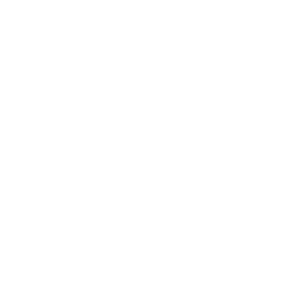

# Bikcraft - Responsivo

## Projeto Portfólio 

### Foi colocado em práticas todo o conteúdo aprendido até o momento no curso de HTML e CSS.

### Também foi desenvolvido a prototipação no Figma, aprendidas no curso de UI Design, sendo utilizadas como base para o desenvolvimento do projeto.

