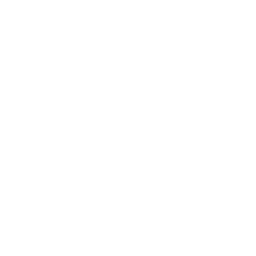

# Projetos e Exercicios - Origamid

Projetos e exercicios realizados nos cursos de UI/UX Design e Front End realizados pela [Origamid](https://www.origamid.com/)

### [Bikcraft](./HTML-CSS-para-iniciantes/Projeto-Final/index.html)

Projeto realizado no curso de HTML e CSS para Iniciantes.

### [Animais Fantasticos](./JavaScript-Completo-ES6/index.html)

Projeto realizado no curso de JavaScript.

### [FlexBlog](./CSS-Flexbox/index.html)

Projeto realizado no curso de CSS Flexbox.

### [Wildbeast](./CSS-Grid-Layout/index.html)

Projeto realizado no curso de CSS Grid Layout.

## Tecnologias:

## Certificados:

